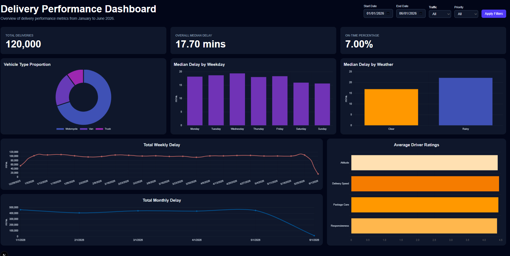

# Synthetic Delivery Performance Analysis Dashboard

A full-stack analytics dashboard for visualizing synthetic delivery performance data. The application provides responsive KPIs and charts with support for date, traffic, and priority filtering.



---

# Tech Stack

## Backend
- PHP 8.5.x (Non-Thread Safe x64)
- Laravel 13
- PostgreSQL
- Redis
- Docker Desktop
- Composer

## Frontend
- Next.js
- React
- Tailwind CSS
- Chart.js
- react-chartjs-2

---

# Prerequisites

Install the following software before running the project.

## 1. PHP

Download **PHP 8.5.x Non-Thread Safe x64** and extract it.

Add the PHP directory to your system PATH.

Create a copy of:

```text
php.ini-development
```

and rename it to:

```text
php.ini
```

Enable the following extensions inside `php.ini` by uncommenting them:

```ini
extension=fileinfo
extension=openssl
extension=pdo_pgsql
extension=pgsql
extension=mbstring
extension=curl
extension=zip
```

### Install the Redis PHP Extension

Download the matching Redis DLL for your PHP version from PECL.

Place:

```text
php_redis.dll
```

inside the PHP `ext` directory.

Then enable it inside `php.ini`:

```ini
extension=redis
```

Verify PHP installation:

```bash
php -v
php --ini
```

---

## 2. Composer

Install Composer.

Verify installation:

```bash
composer --version
```

---

## 3. PostgreSQL

Install PostgreSQL.

(optional) Create a database named:

```text
drivers_deliveries
```

You can choose to skip this step as the migration process later on will automatically create the DB.

---

## 4. Docker Desktop

Install Docker Desktop.

Verify installation:

```bash
docker --version
```

---

## 5. Node.js

Install the latest LTS version of Node.js.

Verify installation:

```bash
node -v
npm -v
```

---

# Backend Setup

Navigate to the backend folder.

```bash
cd backend-laravel
```

Install Laravel dependencies.

```bash
composer install
```

Copy the environment file.

```bash
copy .env.example .env
```

Generate the application key.

```bash
php artisan key:generate
```

Edit the `.env` file.

```env
APP_NAME="Synthetic Driver Behavior Dashboard"

DB_CONNECTION=pgsql
DB_HOST=127.0.0.1
DB_PORT=5432
DB_DATABASE=drivers_deliveries
DB_USERNAME=postgres
DB_PASSWORD=YOUR_PASSWORD

CACHE_STORE=redis

REDIS_CLIENT=phpredis
REDIS_HOST=127.0.0.1
REDIS_PASSWORD=null
REDIS_PORT=6379
```

If the database has not yet been created through Laravel, run:

```bash
php artisan migrate
```

Clear Laravel caches.

```bash
php artisan optimize:clear
```

---

# Frontend Setup

Navigate to the frontend folder.

```bash
cd frontend-next
```

Install dependencies.

```bash
npm install
```

Install Chart.js.

```bash
npm install chart.js react-chartjs-2
```

---

# Running the Application

## Step 1 — Start Redis

If the Redis container already exists:

```bash
docker start laravel-redis
```

Otherwise create it:

```bash
docker run --name laravel-redis -p 6379:6379 redis
```

---

## Step 2 — Start the Laravel Backend

Open a terminal inside:

```text
backend-laravel
```

Run:

```bash
php artisan serve
```

Backend URL:

```text
http://127.0.0.1:8000
```

---

## Step 3 — Start the Next.js Frontend

Open another terminal inside:

```text
frontend-next
```

Run:

```bash
npm run dev
```

Frontend URL:

```text
http://localhost:3000
```

---

# Features

- Responsive Dashboard Visuals
- Vehicle type distribution
- Delay analysis by weekday and weather condition
- Weekly and Monthly delay trend visualization
- Driver rating summary
- Date range, Traffic Condition, and Delivery Priority filtering
- Redis response caching

---

# Project Structure

```text
synthetic-driver-behavior-analysis/
│
├── backend-laravel/
│   ├── app/
│   ├── database/
│   ├── routes/
│   └── .env
│
└── frontend-next/
    ├── app/
    ├── components/
    ├── public/
    └── ...
```
